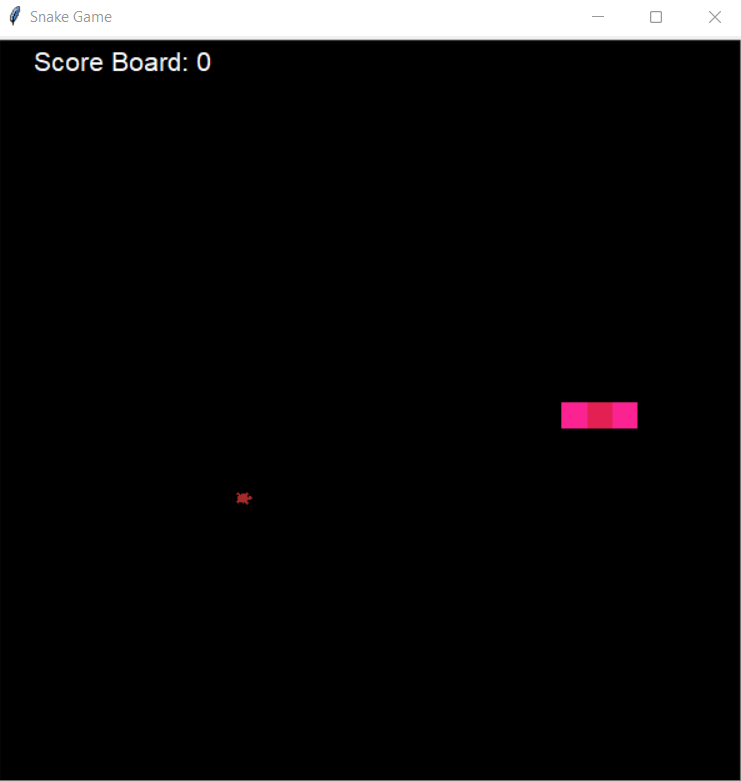

# Game-Snake

### This game was build complete it in python using the library Turtle which provide cool methods, so I hope you enjoy playing a little bit


# 🐍 Installation

If you clone this repository keep in mind that you need to have executed some commands before running the game such as:

if you don't have python in your computer download here:
```
https://www.python.org/downloads/
```

clone the repository
```
https://github.com/sarisp3260/Game-SnakePY
```

And for running the game, write in the terminal this:
```
py main.py
```


